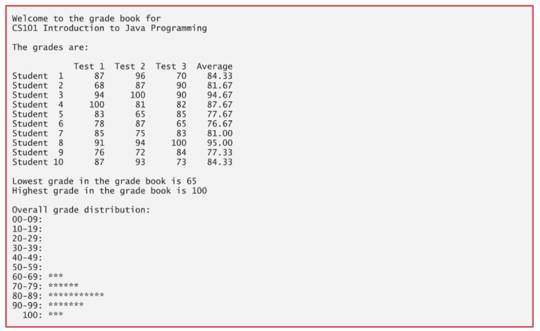

# Deitel - Exercícios

Resolução de alguns exercícios do livro "Java como programar" do Deitel e também outros exercícios de Programação Orientada a Objetos.

## Exercicio 04 (Feito)
> Crie um programa que mostre o resultado da Figura abaixo.
> 

## Exercício 05 (Feito)
> Crie uma classe chamada Ingresso que possuium valor em reais e um método imprimeValor().
> - a) Crie uma classe VIP, que herda Ingresso e possui um valor adicional. Crie um método que retorne o valor do ingresso VIP (com o   adicional incluído).
> - b) Crie uma classe Normal, que herda Ingresso e possui um método que imprime: "Ingresso Normal".
> - c) Crie uma classe CamaroteInferior (que possui a localização do ingresso e métodos para acessar imprimir esta localização) e uma classe CamaroteSuperior, que é mais cara (possui valor adicional). Esta última possui um método para retornar o valor do ingresso. Ambas as classes herdam a classe VIP.

## Exercício 06 (Feito)
> Crie um programa que: 
> - Crie uma classe Produto
>   - Tenha como atributos : comprimento, largura e altura.
>   - Tenha um método para descrever o Produto.
> - Crie uma classe Mesa que herde os atributos e métodos da classe Produto
>   - Sobrescreva o método para descrever o produto.
>   - Crie um método para informar se o produto foi vendido ou não.
>   - Crie um exemplo que mostre a descrição do produto e se o produto foi vendido ou não.
